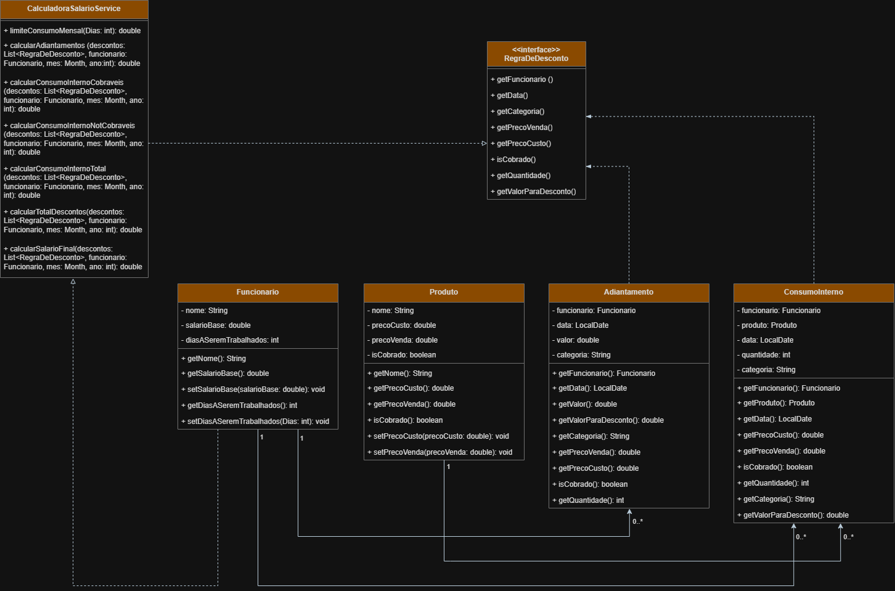
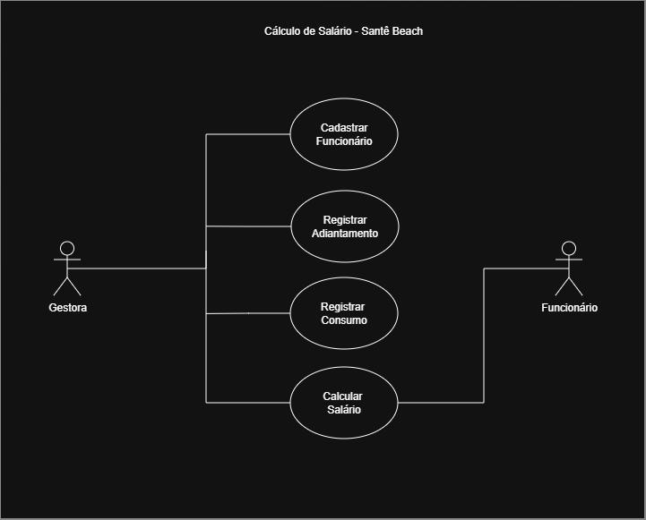

# Sistema de Cálculo de Salário para Funcionários de um Beach Tennis

## 1. Informações gerais do projeto

- Unidade Curricular: Modelos, Métodos e Técnicas de Engenharia de Software – UniBH
- Professor: Lucas Goulart Silva
- Semestre: 2026.1
- Título do projeto: Sistema de Cálculo de Salário para Funcionários de um Beach Tennis
- Repositório GitHub: [https://github.com/emepe/SB-Calculo_de_Salario](https://github.com/emepe/SB-Calculo_de_Salario)

- Integrantes do grupo:
  - Breno Grant – 12319432 – [12319432@ulife.com.br](mailto:12319432@ulife.com.br)
  - João Gabriel Oliveira Tavares – 12314592 – [12314592@ulife.com.br](mailto:12314592@ulife.com.br)
  - Maria Paula Pereira Sousa – 12315841 – [12315841@ulife.com.br](mailto:12315841@ulife.com.br)

***

## 2. Definição do Problema

### 2.1 Contexto

- Tipo de negócio: Estabelecimento de Beach Tennis/Bar;
- Cidade: Belo Horizonte – MG;
- Quantidade de funcionários informais: 2 funcionários fixos;
- Forma de pagamento atual: Salário base mensal ajustado por consumação no bar e adiantamentos, se aplicáveis.

### 2.2 Problema atual

No Santê Beach, o cálculo do salário dos dois funcionários é feito atualmente de forma totalmente manual, com apoio de uma planilha em Excel. Essa planilha possui quatro abas principais. Na primeira aba, há um resumo geral com o valor final a pagar para cada funcionário, incluindo o salário base e todos os descontos aplicados no mês.

A segunda e a terceira aba registram a consumação interna diária de cada funcionário no bar, sendo uma aba para cada pessoa. Sempre que um funcionário consome algum item, como espetinhos, refrigerantes ou doces, esses itens são anotados em outra planilha pelos próprios colaboradores e depois transcritos manualmente pela gestora para a planilha de controle. Ao final do mês, é feito o cálculo de quanto foi consumido acima do limite definido de trinta e seis reais (nos produtos liberados para consumação) ou de itens que não entram como cortesia (por exemplo, bebidas alcoólicas e outros snacks), e esse total é usado como desconto no pagamento.

Na quarta aba, existe uma tabela em formato de calendário, onde são lançados manualmente os dias em que cada funcionário compareceu ao trabalho. A partir dessa visualização, é possível identificar faltas e calcular os descontos correspondentes com base no valor da diária daquele dia.

Todo esse processo depende de lançamentos manuais, cruzamento de informações entre abas e conferência "no olho", o que traz diversas dificuldades na rotina. A cada fechamento de mês, é necessário conferir se todos os dias trabalhados foram marcados corretamente na aba de calendário, se todas as consumações foram transcritas sem erro da planilha que os funcionários preenchem e se todos os adiantamentos foram realmente identificados no extrato bancário.

Como essas informações estão espalhadas em fontes diferentes (planilha de calendário, planilha de consumação, extrato do banco, grupos de WhatsApp, etc), qualquer descuido na digitação de um valor, na escolha de uma célula ou na soma de uma coluna pode gerar erros no cálculo final do salário, sem que isso seja percebido imediatamente. Além disso, o processo é demorado e exige muita atenção, o que aumenta a chance de retrabalho quando é preciso corrigir algum lançamento ou refazer contas. Por fim, a falta de um sistema centralizado dificulta a consulta ao histórico de meses anteriores, tornando mais trabalhoso responder dúvidas dos funcionários sobre pagamentos passados ou comparar períodos diferentes.

### 2.3 Objetivo da solução

Este trabalho propõe o desenvolvimento de um sistema back-end em Java para apoiar o cálculo mensal de salário dos funcionários do Santê Beach, a partir do salário base definido e dos ajustes feitos por adiantamentos e consumação interna registrada ao longo do mês. A solução tem como objetivo automatizar as principais regras de cálculo, reduzir a dependência de planilhas e lançamentos manuais, centralizar as informações em um único sistema e tornar o fechamento mensal dos pagamentos mais rápido, confiável e fácil de conferir.

***

## 3. Escopo do Sistema (Versão 1)

### 3.1 Escopo incluído

O sistema desenvolvido neste trabalho irá:

- Cadastrar funcionários com seus dados básicos (ex.: nome, salário base).
- Registrar adiantamentos de salário para cada funcionário, informando data e valor.
- Registrar consumação interna de cada funcionário no mês (por produto e quantidade total).
- Calcular o total de descontos de um funcionário em um determinado mês, considerando adiantamentos e consumação interna.
- Calcular o total de consumação interna de um funcionário em um determinado mês, aplicando acréscimo de 3% sobre o valor de custo.
- Calcular o salário final do funcionário no mês, considerando:
  - salário base;
  - total de adiantamentos;
  - total de consumação interna (com acréscimo de 3%).

### 3.2 Fora do escopo (por enquanto)

Não serão implementados nesta versão:

- Controle detalhado de faltas e diárias por dia de trabalho.
- Integração com sistemas bancários ou leitura automática de extrato.
- Interface gráfica (web, desktop ou mobile).
- Controle de estoque completo de produtos do bar.

***

## 4. Levantamento e Análise de Requisitos

### 4.1 Atores

- **Gestora do estabelecimento**: responsável por registrar informações e calcular os salários.
- **Funcionário**: pessoa que recebe o salário calculado (usuário indireto do sistema).

### 4.2 User Stories (abordagem ágil)

- **US01** – Como gestora, quero cadastrar os funcionários com seus salários base para que o sistema consiga calcular seus salários mensais.
- **US02** – Como gestora, quero registrar adiantamentos de salário por funcionário para que esses valores sejam descontados no cálculo do mês.
- **US03** – Como gestora, quero registrar a consumação interna de cada funcionário no mês para que o sistema some esses valores com acréscimo de 3% e desconte do salário.
- **US04** – Como gestora, quero solicitar o cálculo do salário final de um funcionário em um determinado mês para saber quanto devo pagar via Pix.
- **US05** – Como gestora, quero visualizar um resumo dos valores considerados no cálculo (salário base, total de descontos e salário final) para conferir antes de realizar o pagamento.

### 4.3 Requisitos funcionais (RF)

- **RF01**: O sistema deve permitir cadastrar funcionários com nome e salário base.
- **RF02**: O sistema deve permitir registrar adiantamentos com data e valor para um funcionário.
- **RF03**: O sistema deve permitir registrar consumação interna para um funcionário, informando produto e quantidade.
- **RF04**: O sistema deve calcular o total de descontos de um funcionário em um mês, somando adiantamentos e consumação interna.
- **RF05**: O sistema deve calcular o total de consumação interna de um funcionário em um mês, aplicando acréscimo de 3%.
- **RF06**: O sistema deve calcular o salário final do funcionário no mês, considerando salário base e total de descontos.
- **RF07**: O sistema deve disponibilizar um resumo dos valores considerados no cálculo do salário de um funcionário.

### 4.4 Requisitos não funcionais (RNF)

- **RNF01**: O sistema deve realizar o cálculo do salário de um funcionário de forma praticamente instantânea, não ultrapassando alguns milissegundos para um mês de dados em memória.
- **RNF02**: O sistema deve garantir consistência dos cálculos, aplicando as mesmas regras de negócio de forma uniforme para todos os funcionários e meses.
- **RNF03**: O sistema deve ser de fácil manutenção, com código organizado em camadas (domínio e serviços) e classes com responsabilidades bem definidas.
- **RNF04**: O sistema deve permitir a inclusão de novas regras de cálculo (por exemplo, controle de faltas) com impacto mínimo nas classes já existentes.
- **RNF05**: O sistema deve armazenar e processar valores monetários com precisão adequada para evitar erros de arredondamento relevantes nos salários.

***

## 5. Modelagem da Solução

### 5.1 Classes no Diagrama de Classes



O sistema de cálculo de salários é composto por seis classes principais: `Funcionario`, `Produto`, `Adiantamento`, `ConsumoInterno`, `RegraDeDesconto` e `CalculadoraSalarioService`.

A classe `Funcionario` representa o colaborador da empresa, armazenando seu nome, salário base e o número de dias a serem trabalhados no mês (padrão: 28). Ela oferece métodos de acesso para ler e alterar esses atributos, sendo a entidade central sobre a qual são calculados adiantamentos, consumos e o salário final.

A classe `Produto` modela os itens disponíveis para consumo interno, contendo o nome do produto, o preço de custo, o preço de venda e um indicador booleano `isCobrado`, que define se o produto é sempre cobrado do funcionário independentemente do limite de cortesia.

A interface `RegraDeDesconto` define o contrato que qualquer tipo de desconto deve seguir, expondo os métodos: `getFuncionario()`, `getData()`, `getCategoria()`, `getPrecoCusto()`, `getPrecoVenda()`, `isCobrado()`, `getQuantidade()` e `getValorParaDesconto()`. Essa abstração permite que novos tipos de desconto sejam adicionados ao sistema sem necessidade de modificar a lógica de cálculo já existente.

A classe `Adiantamento` registra valores adiantados ao funcionário em uma determinada data. Implementa a interface `RegraDeDesconto`, retornando o próprio valor do adiantamento como desconto e a categoria `"Adiantamento"` para identificação no cálculo.

A classe `ConsumoInterno` registra o consumo de produtos realizado por um funcionário em uma data específica. Ela mantém referências a um `Funcionario` e a um `Produto`, bem como a quantidade consumida e a data. Implementa a interface `RegraDeDesconto`, delegando ao produto os atributos de preço, cobrança e categoria `"Consumo"`.

A classe `CalculadoraSalarioService` concentra a lógica de negócio relacionada ao cálculo de valores. Ela recebe uma lista de `RegraDeDesconto` e oferece as seguintes operações:

- `limiteConsumoMensal(int dias)`: calcula o limite de cortesia do mês (R$ 36,00 × número de dias a trabalhar).
- `calcularAdiantamentos(...)`: soma todos os adiantamentos do funcionário no mês.
- `calcularConsumoInternoCobraveis(...)`: soma o custo total dos produtos com `isCobrado = true`.
- `calcularConsumoInternoNotCobraveis(...)`: acumula o valor de venda dos produtos com `isCobrado = false` e retorna apenas o valor que excede o limite de cortesia mensal.
- `calcularConsumoInternoTotal(...)`: soma os consumos cobráveis e o excedente dos não cobráveis, aplicando acréscimo de 3%.
- `calcularTotalDescontos(...)`: soma adiantamentos e consumo interno total.
- `calcularSalarioFinal(...)`: subtrai o total de descontos do salário base do funcionário.

Do ponto de vista de relacionamentos, um `Funcionario` pode estar associado a vários `Adiantamento` e a vários `ConsumoInterno` (multiplicidade 1 para o funcionário e 0..* para os registros). Cada `ConsumoInterno` está associado a exatamente um `Produto`, enquanto um `Produto` pode aparecer em muitos registros de consumo. Tanto `Adiantamento` quanto `ConsumoInterno` implementam a interface `RegraDeDesconto`. A classe `CalculadoraSalarioService` depende da abstração `RegraDeDesconto`, sem depender diretamente das classes concretas.

### 5.2 Diagrama de Caso de Uso


O diagrama de caso de uso representa as interações entre os atores externos e as
funcionalidades oferecidas pelo sistema, delimitadas pelo retângulo que representa
o escopo do **Cálculo de Salário – Santê Beach**.

#### Atores

- **Gestora**: ator principal do sistema. É a responsável por operar todas as
  funcionalidades disponíveis, realizando cadastros, registros e solicitando o
  cálculo do salário dos funcionários.
- **Funcionário**: ator secundário (usuário indireto). Não interage diretamente
  com o sistema, mas é o beneficiário do resultado gerado pelo caso de uso
  *Calcular Salário*, recebendo o valor final a ser pago.

#### Casos de uso

- **Cadastrar Funcionário**: permite à gestora registrar um novo funcionário no
  sistema, informando nome e salário base. É o pré-requisito para os demais
  casos de uso.
- **Registrar Adiantamento**: permite à gestora lançar um adiantamento de salário
  feito a um funcionário, informando data e valor. O valor será descontado no
  cálculo do mês correspondente.
- **Registrar Consumo**: permite à gestora registrar o consumo interno de produtos
  realizado por um funcionário, informando o produto e a quantidade consumida.
  O custo total com acréscimo de 3% será descontado do salário.
- **Calcular Salário**: permite à gestora obter o salário final de um funcionário
  em um determinado mês, considerando o salário base, os adiantamentos e os
  consumos registrados. O Funcionário é associado a este caso de uso por ser o
  destinatário do valor calculado.

***

## 6. Desenvolvimento da Solução

### 6.1 Tecnologias utilizadas

O projeto foi desenvolvido em Java, com foco na implementação back-end da regra de cálculo salarial dos funcionários. Para validação do comportamento da aplicação, foram criados testes unitários utilizando JUnit. O desenvolvimento e a organização do repositório foram realizados com apoio de ferramentas de versionamento e ambiente de desenvolvimento.

- Linguagem: Java (versão 17.0.19).
- Frameworks/bibliotecas: JUnit 5 para testes unitários.
- Ferramentas: IDE VS Code, Git, GitHub.

### 6.2 Organização do código

O projeto foi organizado em diretórios separados para arquivos compilados, bibliotecas externas, código-fonte, testes e documentação. Dentro da pasta `src`, as classes foram distribuídas em pacotes Java de acordo com sua responsabilidade, separando a aplicação principal, as entidades de domínio e a camada de serviço. Os testes unitários foram mantidos em uma estrutura paralela na pasta `test`, enquanto a pasta `bin` armazena os arquivos compilados e a pasta `lib` reúne as bibliotecas utilizadas no projeto.

```text
SB-CALCULO_DE_SALARIO/
├── bin/
│   └── br/
│       └── com/
│           └── santebeach/
│               └── salario/
│                   ├── app/
│                   │   └── Main.class
│                   ├── model/
│                   │   ├── Adiantamento.class
│                   │   ├── ConsumoInterno.class
│                   │   ├── Funcionario.class
│                   │   ├── Produto.class
│                   │   └── RegraDeDesconto.class
│                   ├── service/
│                   │   └── CalculadoraSalarioService.class
│                   └── CalculadoraSalarioServiceTest.class
├── diagrams/
│   ├── DiagramaDeClasses.drawio
│   └── DiagramaDeClasses.png
├── lib/
│   ├── byte-buddy-1.14.0.jar
│   ├── byte-buddy-agent-1.14.0.jar
│   ├── junit-jupiter-api-5.10.2.jar
│   ├── junit-jupiter-engine-5.10.2.jar
│   ├── junit-platform-console-standalone-1.10.2.jar
│   └── mockito-core-5.8.0.jar
├── src/
│   └── br/
│       └── com/
│           └── santebeach/
│               └── salario/
│                   ├── app/
│                   │   └── Main.java
│                   ├── model/
│                   │   ├── Adiantamento.java
│                   │   ├── ConsumoInterno.java
│                   │   ├── Funcionario.java
│                   │   ├── Produto.java
│                   │   └── RegraDeDesconto.java
│                   └── service/
│                       └── CalculadoraSalarioService.java
├── test/
│   └── br/
│       └── com/
│           └── santebeach/
│               └── salario/
│                   └── service/
│                       └── CalculadoraSalarioServiceTest.java
└── DOCUMENTACAO.md
```

### 6.3 Princípios SOLID e padrões de projeto

#### SRP – Single Responsibility Principle

Cada classe tem uma responsabilidade bem definida:

- `Funcionario`: representa o colaborador, armazenando nome, salário base e dias a serem trabalhados.
- `Produto`: representa um item consumível, com nome, preço de custo, preço de venda e indicador de cobrança.
- `Adiantamento`: representa um adiantamento financeiro feito a um funcionário em uma data específica, implementando a regra de desconto correspondente.
- `ConsumoInterno`: representa um registro de consumo de produtos por cada funcionário, delegando ao produto as informações de preço e cobrança.
- `RegraDeDesconto`: define o contrato de qualquer desconto aplicável ao salário, sem carregar lógica de cálculo própria.
- `CalculadoraSalarioService`: concentra exclusivamente a lógica de cálculo do salário final, somando os descontos e subtraindo do salário base.

#### OCP – Open/Closed Principle

O sistema está aberto para extensão e fechado para modificação. A interface `RegraDeDesconto` permite que novos tipos de desconto (por exemplo, desconto por falta ou desconto por uniforme) sejam adicionados criando uma nova classe que implemente essa interface, sem necessidade de alterar a `CalculadoraSalarioService` ou qualquer outra classe existente.

#### LSP – Liskov Substitution Principle

As classes `Adiantamento` e `ConsumoInterno` implementam a interface `RegraDeDesconto` e podem ser usadas em qualquer lugar onde um `RegraDeDesconto` é esperado, sem quebrar o comportamento do sistema. A `CalculadoraSalarioService` trabalha com uma lista de `RegraDeDesconto` e opera corretamente independentemente de quais implementações concretas estejam presentes nessa lista.

#### ISP – Interface Segregation Principle

A interface `RegraDeDesconto` é coesa e específica, contendo apenas os métodos que qualquer desconto precisa expor: `getFuncionario()`, `getData()`, `getCategoria()`, `getPrecoCusto()`, `getPrecoVenda()`, `isCobrado()`, `getQuantidade()` e `getValorParaDesconto()`. Nenhuma classe é forçada a implementar métodos que não fazem sentido para ela.

#### DIP – Dependency Inversion Principle

A classe `CalculadoraSalarioService`, que representa a camada de alto nível do sistema, não depende das classes concretas `Adiantamento` ou `ConsumoInterno`. Ela depende exclusivamente da abstração `RegraDeDesconto`, invertendo a dependência e tornando o sistema mais flexível e desacoplado.

***

## 7. Testes Unitários

### 7.1 Estratégia de testes

Os testes foram implementados com JUnit 5, cobrindo os principais cenários da lógica de cálculo salarial. Cada teste instancia diretamente as classes do modelo (`Funcionario`, `Produto`, `Adiantamento`, `ConsumoInterno`) e invoca o método `calcularSalarioFinal` da `CalculadoraSalarioService`, verificando o resultado com `assertEquals`.

A regra de cortesia adotada é: cada funcionário possui um limite mensal de R$ 36,00 por dia a ser trabalhado (padrão: 28 dias = R$ 1.008,00). Produtos com `isCobrado = false` são tratados como cortesia enquanto o consumo acumulado não ultrapassar esse limite; apenas o valor excedente é descontado. Produtos com `isCobrado = true` são sempre descontados integralmente, independentemente do limite.

### 7.2 Casos de teste implementados

| # | Nome do teste | Cenário | Resultado esperado |
|---|---|---|---|
| 1 | `deveCalcularSalarioSemAdiantamentoNemConsumo` | Funcionário com salário base de R$ 2.500,00, sem nenhum desconto registrado | R$ 2.500,00 |
| 2 | `deveDescontarAdiantamentosDoSalario` | Dois adiantamentos de R$ 300,00 e R$ 200,00 no mesmo mês | R$ 2.000,00 |
| 3 | `deveContarComoCortesiaOConsumoInternoDoSalario` | Consumo de 2 espetos (`isCobrado = false`), totalizando R$ 24,00 em valor de venda — abaixo do limite de R$ 1.008,00 | R$ 2.500,00 (consumo contabilizado como cortesia, sem desconto) |
| 4 | `deveDescontarAdiantamentosEConsumoJuntos` | Adiantamento de R$ 300,00 + consumo de 3 refrigerantes (`isCobrado = false`) totalizando R$ 18,00 em valor de venda — dentro do limite | R$ 2.200,00 (só o adiantamento é descontado) |
| 5 | `deveDescontarConsumoExcedido` | Consumo de 169 refrigerantes (`isCobrado = false`) a R$ 6,00 cada (venda) = R$ 1.014,00 — excede o limite de R$ 1.008,00 em R$ 6,00; aplica-se o preço de custo (R$ 3,50) × 1,03 sobre o excedente | R$ 2.500,00 − (R$ 3,50 × 1,03) |
| 6 | `deveDescontarAdiantamentosEConsumoExcedidoJuntos` | Adiantamento de R$ 300,00 + mesmo consumo excedido do teste 5 | R$ 2.500,00 − R$ 300,00 − (R$ 3,50 × 1,03) |

### 7.3 Resultado da execução

Todos os 6 testes passaram com sucesso:

```text
+-- JUnit Jupiter [OK]
| '-- CalculadoraSalarioServiceTest [OK]
|   +-- deveCalcularSalarioSemAdiantamentoNemConsumo() [OK]
|   +-- deveDescontarAdiantamentosDoSalario() [OK]
|   +-- deveContarComoCortesiaOConsumoInternoDoSalario() [OK]
|   +-- deveDescontarAdiantamentosEConsumoJuntos() [OK]
|   +-- deveDescontarConsumoExcedido() [OK]
|   '-- deveDescontarAdiantamentosEConsumoExcedidoJuntos() [OK]

[  6 tests found      ]
[  6 tests successful ]
[  0 tests failed     ]
```

***

## 8. Execução do Projeto

### 8.1 Pré-requisitos

- Java JDK 17 ou superior instalado.
- Git instalado.
- Terminal (Git Bash, PowerShell ou CMD no Windows; bash no Linux/macOS).

### 8.2 Clonar o repositório

```powershell
git clone https://github.com/emepe/SB-Calculo_de_Salario.git
cd SB-Calculo_de_Salario
```

### 8.3 Compilar o código-fonte

```powershell
javac -cp "lib/junit-jupiter-api-5.10.2.jar" -d bin (Get-ChildItem -Recurse src -Filter "*.java").FullName
```

### 8.4 Executar a aplicação principal

```powershell
java -cp bin br.com.santebeach.salario.app.Main
```

### 8.5 Compilar os testes

```powershell
javac -cp "bin;lib/junit-jupiter-api-5.10.2.jar" -d bin test/br/com/santebeach/salario/service/CalculadoraSalarioServiceTest.java
```

### 8.6 Executar os testes

```powershell
java -jar lib/junit-platform-console-standalone-1.10.2.jar --class-path bin --scan-classpath
```

### 8.7 Saída esperada dos testes

```text
+-- JUnit Jupiter [OK]
| '-- CalculadoraSalarioServiceTest [OK]
|   +-- deveCalcularSalarioSemAdiantamentoNemConsumo() [OK]
|   +-- deveDescontarAdiantamentosDoSalario() [OK]
|   +-- deveContarComoCortesiaOConsumoInternoDoSalario() [OK]
|   +-- deveDescontarAdiantamentosEConsumoJuntos() [OK]
|   +-- deveDescontarConsumoExcedido() [OK]
|   '-- deveDescontarAdiantamentosEConsumoExcedidoJuntos() [OK]
+-- JUnit Vintage [OK]
'-- JUnit Platform Suite [OK]

[         4 containers found      ]
[         0 containers skipped    ]
[         4 containers started    ]
[         0 containers aborted    ]
[         4 containers successful ]
[         0 containers failed     ]
[         6 tests found           ]
[         0 tests skipped         ]
[         6 tests started         ]
[         0 tests aborted         ]
[         6 tests successful      ]
[         0 tests failed          ]
```